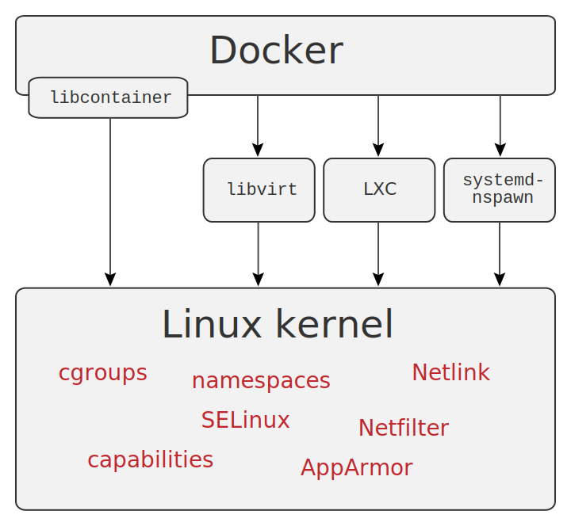

# Background 
## The Technology That Makes Containers Possible 

### Kernel features 
* [Namespaces](https://en.wikipedia.org/wiki/Linux_namespaces)
* [Cgroups](https://en.wikipedia.org/wiki/Cgroups) 
* [Capabilities](https://www.vultr.com/docs/working-with-linux-capabilities)

### Other technology 
* [Union Capable filesystem](https://medium.com/@paccattam/drooling-over-docker-2-understanding-union-file-systems-2e9bf204177c)

**Note**: Docker not available in RHEL 6 because of kernel dependencies.

From [Wikipedia](https://en.wikipedia.org/wiki/Docker_(software))

[Next](vmsvcontainers.md)

